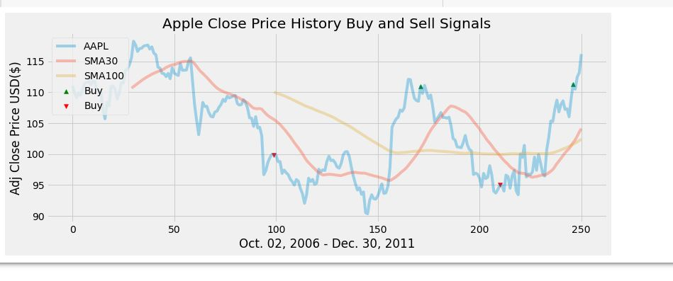

# PythonTradingScript

This is a code along I found <a href src="https://www.youtube.com/watch?v=SEQbb8w7VTw">here,</a> it uses Python, Google Colab, a CSV, and a few libraries to predict trends in the Apple stock price.  While it was fun to make, it was wildly unsuccessful at predicting the market (see picture below.)

If you decide to do this project there seems to be an error in the video at the 22 minute mark.  A solution that I found is here:

x = buy_sell(signal)

signal['Buy_Signal_Price'] = x[0]

signal['Sell_Signal_Price'] = x[1]

Also you will need to ensure that you have your third party cookies enabled or Google Colab will give you errors.

